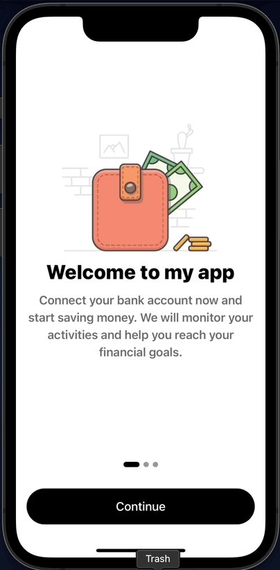
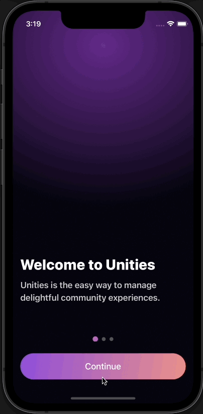

# react-native-onboard

[](https://www.npmjs.com/package/react-native-onboard)
[](https://github.com/FrigadeHQ/react-native-onboard/actions/workflows/tests.yml)
[](https://www.npmjs.com/package/react-native-onboard)
[](https://github.com/prettier/prettier)

Delightful and fully customizable onboarding components for React Native.



See [Live Demo](https://snack.expo.dev/@christian-frigade/react-native-onboard-simple-demo) on Expo Snack

## Features

- 🎨 Fully customizable components and config
- 🔧 Load images and content from your backend
- 🚀 Works with Expo
- 📦 Very lightweight (~35 kB)
- ✨ Beautiful default UI

## Installation

Install the package with either npm or yarn:

```bash
npm install react-native-onboard
```
or
```bash
yarn add react-native-onboard
```

## Quick start
Place the `OnboardFlow` component anywhere in your app. It will automatically take up the entire screen.

Set `fullscreenModal` to `false` if you want to use it as a component.

```jsx
import { OnboardFlow } from 'react-native-onboard';

<OnboardFlow fullscreenModal={true} pages={[
  {
    title: 'Welcome to my app',
    subtitle: 'Cool description of my app',
    imageUri: 'https://illlustrations.co/static/f8a168f23ea5623d0c8987b551729183/day78-wallet.png',
  },
  {
    title: 'Page 2 header',
    subtitle: 'Welcome to page 2',
    imageComponent: <MyCustomComponent/>
  }]} />
```

## Customization
`react-native-onboard` is designed to be headless and customizable. You can use the default UI or create your own by
implementing a series of provided interfaces.




## Get in touch
Questions? Comments? Suggestions? Feel free to [open an issue](https://github.com/FrigadeHQ/react-native-onboard/issues), [submit a PR](https://github.com/FrigadeHQ/react-native-onboard/pulls), or [contact us](https://frigade.com).